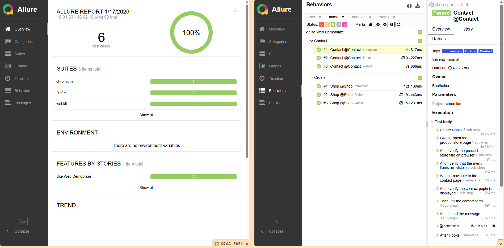

# 🎭 Playwright TypeScript Automation Framework - Demoblaze

[](https://playwright.dev/)
[](https://www.typescriptlang.org/)
[](https://allurereport.org/)
[](https://github.com/features/actions)

---
<!-- Navigation -->
<p align="center">
<a href="#-english">🇬🇧 English</a> | <a href="#-français">🇫🇷 Français</a>
</p>

---
## 🇬🇧 English

### 📝 Overview
This project is an End-to-End (E2E) automation framework for the Demoblaze e-commerce demo site.
Built with Playwright and TypeScript, it strictly follows the Page Object Model (POM) design pattern to ensure maintainability and scalability suitable for enterprise environments.

### 💡 Architectural Decisions
* **Why Playwright?** For its native parallel execution, "Auto-wait" capabilities (reducing flaky tests), and built-in support for modern web features (Shadow DOM).
* **Why POM?** To decouple test logic from UI implementation. UI changes only require updates in the Page Class, keeping tests clean and readable.
* **Why Allure?** To provide clear, graphical insights into test stability and coverage for stakeholders.

### 🚀 Key Features
* **Robust POM Architecture :** Clear separation between test logic and UI interactions (`src/pages`).
* **Data Driven Testing :** Usage of typed JSON files (TypeScript Interfaces) for managing products and datasets.
* **Advanced Handling :** Network response interception (`waitForResponse`) and native browser dialog handling.
* **Reporting :** Full integration with **Allure Report** (Steps, Epics, Features).
* **CI/CD Pipeline :** Workflow GitHub Actions avec gestion intelligente des dépendances (installation conditionnelle des navigateurs) et déclenchement manuel avec paramètres.

### ⚙️ Prerequisite
* Node.js (LTS recommanded)
* npm

### 📦 Setup
Clone the project and install dependencies:
```bash
# 1. Clone the project (download the code)
git clone https://github.com/Bout-Gabouz-LeMasle/Portfolio-Playwright.git

#2. Enter the project folder
cd Portfolio-Playwright

# 3. Install dependencies
npm ci

#4. Install Playwright browsers
npx playwright install --with-deps
```

### ▶️ Execution
```bash
Run all tests :
npx playwright test

Run with tag (ex: Tests Contact ou Shop) :
npx playwright test --grep @Contact
npx playwright test --grep @Shop

Run on specific browser :
npx playwright test --project=chromium

Generate & open report :
npx allure generate ./allure-results -o ./allure-report --clean
npx allure open ./allure-report
```

### 🏗️ Project Structure
```text
├── .github/
│   └── workflows/      # CI/CD Configuration (GitHub Actions)
├── src/
│   ├── interfaces/     # Types TypeScript (ex: Product, User)
│   ├── pages/          # Page Objects (ex: LoginPage, CartPage)
│   └── utils/          # Utility functions (ex: random generators)
├── tests/
│   ├── data/           # Data Set (JSON)
│   └── specs/          # Test scenarios (ex: e2e.spec.ts)
├── playwright.config.ts # Global configuration of the framework
├── package.json         # Dependencies and scripts
└── README.md            # Documentation
```

### 📸 Reporting Overview



*Designed, developed, and maintained by **Boutheina Le Masle** - Senior QA Automation Architect*

## 🇫🇷 Français

### 📝 Description
Ce projet est un framework d'automatisation de tests End-to-End (E2E) pour le site e-commerce de démonstration **Demoblaze**.
Il a été conçu avec **Playwright** et **TypeScript**, en suivant strictement le patron de conception **Page Object Model (POM)** pour assurer la maintenabilité et la scalabilité des tests.

### 💡 Choix Architecturaux
* **Pourquoi Playwright ?** Pour sa vitesse d'exécution (parallélisation native), sa fiabilité (auto-wait) et sa gestion moderne du DOM.
* **Pourquoi POM ?** Pour séparer la logique de test de l'interface utilisateur, facilitant la maintenance en cas de changement d'UI.
* **Pourquoi Allure ?** Pour offrir une visibilité graphique claire sur la qualité du projet aux équipes métier et techniques.

### 🚀 Fonctionnalités Clés
* **Architecture POM Robuste :** Séparation claire entre la logique de test et les interactions avec l'UI (`src/pages`).
* **Data Driven Testing :** Utilisation de fichiers JSON typés (Interfaces TypeScript) pour gérer les produits et les jeux de données.
* **Gestion Avancée :** Interception des réponses réseau (`waitForResponse`) et gestion des dialogues natifs navigateurs.
* **Reporting :** Intégration complète avec **Allure Report** (Steps, Epics, Features).
* **CI/CD Optimisée :** Workflow GitHub Actions avec gestion intelligente des dépendances (installation conditionnelle des navigateurs) et déclenchement manuel avec paramètres.

### ⚙️ Prérequis
* Node.js (LTS recommandé)
* npm

### 📦 Installation
Cloner le projet et installer les dépendances :

```bash
# 1. Cloner le projet (Télécharger le code)
git clone https://github.com/Bout-Gabouz-LeMasle/Portfolio-Playwright.git

# 2. Entrer dans le dossier du projet
cd Portfolio-Playwright

# 3. Installer les dépendances
npm ci

# 4. Installer les navigateurs Playwright
npx playwright install --with-deps
```

### ▶️ Exécution des Tests

```bash
Lancer tous les tests :
npx playwright test

Lancer par Tag (ex: Tests critiques ou Shop) :
npx playwright test --grep @Critical
npx playwright test --grep @Shop

Lancer sur un navigateur spécifique :
npx playwright test --project=chromium

Générer et ouvrir le rapport Allure :
npx allure generate ./allure-results -o ./allure-report --clean
npx allure open ./allure-report
```

### 🏗️ Structure du Projet
```text
├── .github/
│   └── workflows/      # Configuration CI/CD (GitHub Actions)
├── src/
│   ├── interfaces/     # Types TypeScript (ex: Product, User)
│   ├── pages/          # Page Objects (ex: LoginPage, CartPage)
│   └── utils/          # Fonctions utilitaires (ex: random generators)
├── tests/
│   ├── data/           # Jeux de données (JSON)
│   └── specs/          # Scénarios de tests (ex: e2e.spec.ts)
├── playwright.config.ts # Configuration globale du framework
├── package.json         # Dépendances et scripts
└── README.md            # Documentation
```

### 📸 Aperçu du Reporting


*Conçu, développé et maintenu par **Boutheina Le Masle** - Senior QA Automation Architect*